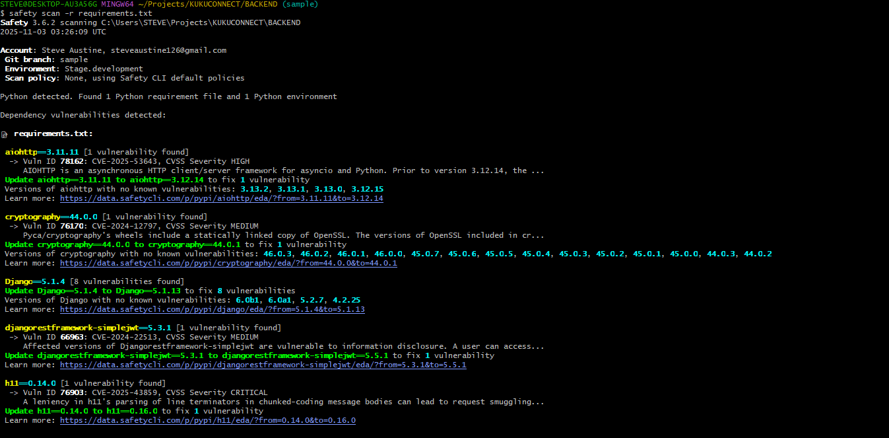
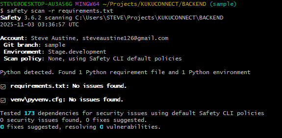

# KUKUCONNECT Security Remediation (OWASP Top 10)

## 1. Project Overview

**Project Title:** KUKUCONNECT  
**System Description:**  
KUKUCONNECT is a modern AgriTech platform designed to bridge the gap between farmers, buyers, and suppliers. Built with cutting-edge technologies, it empowers agricultural communities with tools to connect, trade, and innovate seamlessly.

---

## 2. OWASP Top 10 Security Remediation

This document details the security measures implemented in the KUKUCONNECT API, addressing the OWASP Top 10 vulnerabilities.

---

### A01: Broken Access Control

* **Problem:**  
  Several API endpoints, such as `ProductEditView` and `FarmerProfileDetailView`, only checked if a user was authenticated (`permissions.IsAuthenticated`) but failed to verify if the user *owned* the resource they were trying to access. This allowed any logged-in user to view, edit, or delete other users’ products or profile data.

* **Solution:**  
  The `get_queryset()` method on these views was overridden to ensure all lookups are filtered by the authenticated user (`self.request.user`), enforcing object-level permissions.

* **Code Snippets (`BACKEND/products/views.py`):**

    **Before (Vulnerable):**
    ```python
    class ProductEditView(generics.RetrieveUpdateDestroyAPIView):
        queryset = Product.objects.all()  # <-- Problem: Fetches ALL products
        serializer_class = ProductSerializer
        permission_classes = [permissions.IsAuthenticated]
    ```

    **After (Secure):**
    ```python
    class ProductEditView(generics.RetrieveUpdateDestroyAPIView):
        queryset = Product.objects.all()
        serializer_class = ProductSerializer
        permission_classes = [permissions.IsAuthenticated]

        # FIXED: BROKEN ACCESS CONTROL
        # Ensures the user can only modify products they own.
        def get_queryset(self):
            user = self.request.user
            if user.is_authenticated:
                return self.queryset.filter(farmer=user)
            return Product.objects.none()
    ```

---

### A02: Cryptographic Failures

* **Problem:**  
  The application did not enforce HTTPS in production, risking transmission of sensitive data (passwords, JWTs) in plain text.

* **Solution:**  
  Production-only security settings were added in `settings.py` to enforce HTTPS/TLS, secure cookies, and enable HSTS. `SECURE_PROXY_SSL_HEADER` was added for proxy environments like Render.

* **Code Snippets (`BACKEND/KUKUCONNECT/settings.py`):**
    ```python
    # FIXED: A02: CRYPTOGRAPHIC FAILURES
    if not DEBUG:
        SECURE_PROXY_SSL_HEADER = ('HTTP_X_FORWARDED_PROTO', 'https')
        SECURE_SSL_REDIRECT = True
        SESSION_COOKIE_SECURE = True
        CSRF_COOKIE_SECURE = True
        SECURE_HSTS_SECONDS = 3600
        SECURE_HSTS_INCLUDE_SUBDOMAINS = True
        SECURE_HSTS_PRELOAD = True
    ```

---

### A03: Injection (SQLi & XSS)

* **Problem:**  
  Potential for SQL Injection or XSS if user input was not sanitized.

* **Solution:**  
  **No vulnerability found.**  
  - **SQLi:** Django ORM parameterizes all queries, preventing SQL injection.  
  - **XSS:** React escapes all user-supplied data by default, preventing malicious script execution.

---

### A04: Insecure Design

* **Problem:**  
  Lack of security-first architecture; early presence of A01 and A05 vulnerabilities showed functionality was prioritized over safety.

* **Solution:**  
  Addressing the other OWASP issues (access control, configuration, HTTPS, logging) hardened the entire design, aligning with secure-by-default principles.

---

### A05: Security Misconfiguration

* **Problem:**  
  `settings.py` had multiple insecure defaults — hardcoded `SECRET_KEY`, `DEBUG=True`, `ALLOWED_HOSTS=['*']`, and `CORS_ALLOW_ALL_ORIGINS=True`.

* **Solution:**  
  Secrets and environment-specific values are now read from environment variables (`os.environ.get()`). Added `python-dotenv` for local `.env` management. Secure defaults enforced (`DEBUG=False`, restricted CORS).

* **Code Snippets (`BACKEND/KUKUCONNECT/settings.py`):**

    **Before (Vulnerable):**
    ```python
    SECRET_KEY = 'django-insecure-x+5fh32v2@su4$d&3cvydn%kdn9p$x546de6h%-uhamnj30fnp'
    DEBUG = True
    ALLOWED_HOSTS = ['*']
    CORS_ALLOW_ALL_ORIGINS = True
    ```

    **After (Secure):**
    ```python
    from dotenv import load_dotenv
    import os

    load_dotenv(os.path.join(BASE_DIR, '.env'))

    SECRET_KEY = os.environ.get('SECRET_KEY')
    DEBUG = os.environ.get('DEBUG', 'False') == 'True'
    ALLOWED_HOSTS = os.environ.get('ALLOWED_HOSTS', 'localhost,127.0.0.1').split(',')
    CORS_ALLOW_ALL_ORIGINS = False
    CORS_ALLOWED_ORIGINS = os.environ.get('CORS_ALLOWED_ORIGINS', 'http://localhost:5173').split(',')
    ```

---

### A06: Vulnerable and Outdated Components

* **Problem:** A `safety` scan revealed that the project's `requirements.txt` file contained 15 known vulnerabilities across 7 packages, including `Django` itself, `djangorestframework-simplejwt`, and a **CRITICAL** vulnerability in `h11`.

    **Initial Scan Report (Problem):**
    

* **Solution:** All vulnerable packages were upgraded to their latest patched versions using `pip install --upgrade`. This also required upgrading `httpcore` to resolve a dependency conflict. The `requirements.txt` file was then regenerated. A follow-up scan confirms all 15 vulnerabilities were resolved.

    **Final Scan Report (Solution):**
    

---


### A07: Identification and Authentication Failures

* **Problem:**  
  Weak password policy allowed users to create easily guessable passwords.

* **Solution:**  
  Strengthened password validation by enforcing a minimum 10-character length.

* **Code Snippets (`BACKEND/KUKUCONNECT/settings.py`):**
    ```python
    AUTH_PASSWORD_VALIDATORS = [
        { 'NAME': 'django.contrib.auth.password_validation.UserAttributeSimilarityValidator' },
        {
            'NAME': 'django.contrib.auth.password_validation.MinimumLengthValidator',
            'OPTIONS': { 'min_length': 10 }
        },
        { 'NAME': 'django.contrib.auth.password_validation.CommonPasswordValidator' },
        { 'NAME': 'django.contrib.auth.password_validation.NumericPasswordValidator' },
    ]
    ```

---

### A08: Software and Data Integrity Failures

* **Problem:**  
  Risk of Remote Code Execution (RCE) from insecure deserialization if using Python `pickle`.

* **Solution:**  
  **No vulnerability found.**  
  The system exclusively uses JSON for API communication, which is data-only and cannot execute arbitrary code.

---

### A09: Security Logging and Monitoring Failures

* **Problem:**  
  No `LOGGING` configuration existed, preventing detection and audit of security-relevant events.

* **Solution:**  
  Added a robust logging configuration capturing all `INFO` level events and `django.security` warnings. Output streams to Render’s console for monitoring.

* **Code Snippets (`BACKEND/KUKUCONNECT/settings.py`):**
    ```python
    LOGGING = {
        'version': 1,
        'disable_existing_loggers': False,
        'formatters': {
            'verbose': {
                'format': '{levelname} {asctime} {module} {message}',
                'style': '{',
            },
        },
        'handlers': {
            'console': {
                'level': 'INFO',
                'class': 'logging.StreamHandler',
                'formatter': 'verbose',
            },
        },
        'loggers': {
            'django': {
                'handlers': ['console'],
                'level': 'INFO',
                'propagate': True,
            },
            'django.security': {
                'handlers': ['console'],
                'level': 'WARNING',
                'propagate': False,
            },
        },
    }
    ```

---

### A10: Server-Side Request Forgery (SSRF)

* **Problem:**  
  SSRF can occur if user-supplied URLs are fetched by the server.

* **Solution:**  
  **No vulnerability found.**  
  The system does not make requests to user-supplied URLs. All external APIs (e.g., Mpesa) use environment-configured base URLs.

---

## 3. Summary

Through these remediations, KUKUCONNECT’s API now adheres to OWASP Top 10 security best practices.  
The system enforces least privilege, encrypts all traffic, validates inputs, uses secure dependencies, logs key events, and avoids insecure design patterns — forming a strong, secure-by-default foundation.
